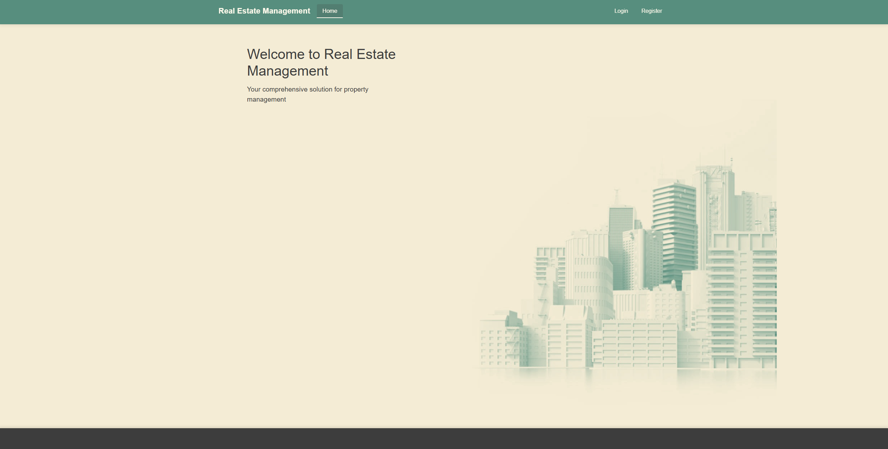
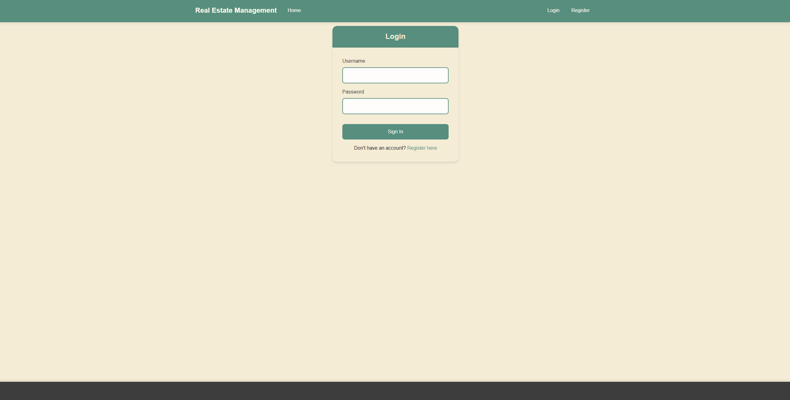
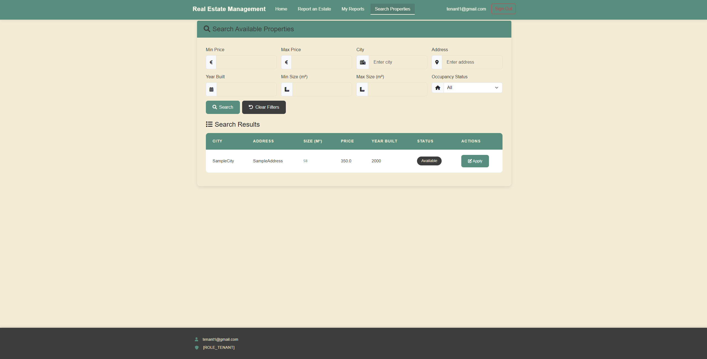
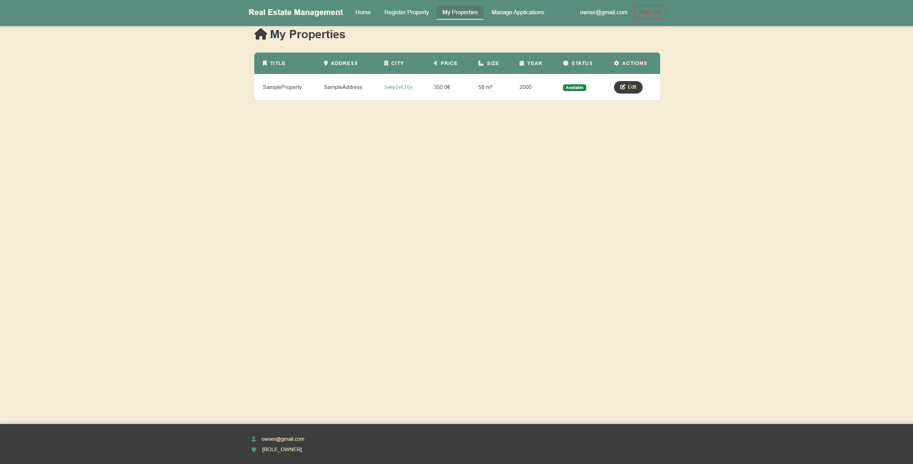

# Real Estates Management System

A comprehensive web application for managing real estate properties, facilitating interactions between property owners and tenants. Built with Spring Boot and Thymeleaf.

## Screenshots

<!-- Add screenshots of your application here -->

| Home | Login Page |
|:---:|:---:|
|  |  |

| Search Properties | My Properties |
|:---:|:---:|
|  |  |

## Features

*   **User Roles**: Distinct roles for **Admins**, **Owners**, and **Tenants**.
*   **Property Management**: Owners can list and manage their real estate properties.
*   **Applications**: Tenants can browse properties and submit applications.
*   **Reporting**: System for reporting issues or providing feedback.
*   **Authentication**: Secure login and registration system using Spring Security.

## Tech Stack

*   **Java**: 21
*   **Framework**: Spring Boot 3.3.7
*   **Template Engine**: Thymeleaf
*   **Database**: PostgreSQL
*   **Build Tool**: Maven

## Installation & Setup

1.  **Clone the repository**
    ```bash
    git clone https://github.com/KDim67/Real-Estates-Management-System.git
    cd Real-Estates-Management-System
    ```

2.  **Database Configuration**
    *   Create a PostgreSQL database.
    *   Copy `src/main/resources/application.properties.example` to `src/main/resources/application.properties`:
        ```bash
        cp src/main/resources/application.properties.example src/main/resources/application.properties
        ```
    *   Open `src/main/resources/application.properties` and update the database connection details:

    ```properties
    spring.datasource.url=jdbc:postgresql://localhost:5432/your_database_name
    spring.datasource.username=your_username
    spring.datasource.password=your_password
    ```

3.  **Run the Application**
    Use the included Maven wrapper to run the app:
    ```bash
    ./mvnw spring-boot:run
    ```

4.  **Access the App**
    Open your browser and navigate to: `http://localhost:8080`

## Creating an Admin User

The application does not have a built-in admin registration page. To create an admin user:

1.  **Register as a regular user** (Tenant or Owner) through the registration page.
2.  **Access your database** using a PostgreSQL client (e.g., pgAdmin, psql, DBeaver).
3.  **Find the user ID** from the `users` table:
    ```sql
    SELECT userId, username, email, status FROM users WHERE username = 'your_username';
    ```
4.  **Update the user's role** in the `user_roles` table:
    ```sql
    -- Update the role_id to 3 (ADMIN) in user_roles table
    UPDATE user_roles SET role_id = 3 WHERE user_id = 'your_user_id';
    ```
5.  **Approve the user** by updating their status in the `users` table:
    ```sql
    -- Set status to 1 (approved) to give admin access to the system
    UPDATE users SET status = 1 WHERE userId = 'your_user_id';
    ```
6.  **Log in again** with the updated admin credentials to access admin features.


